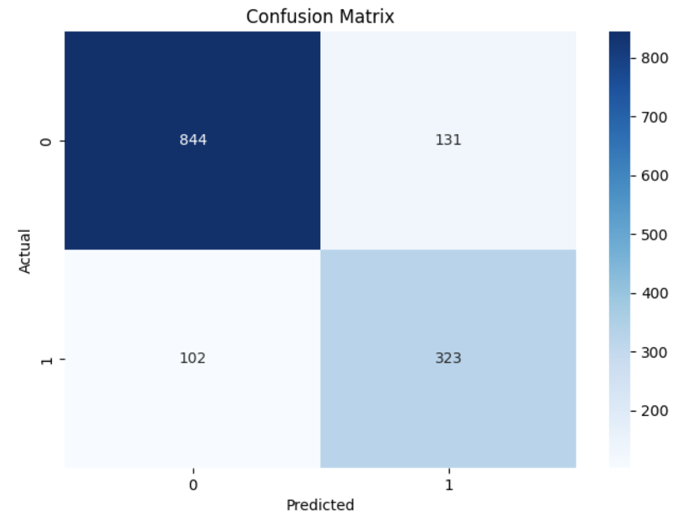
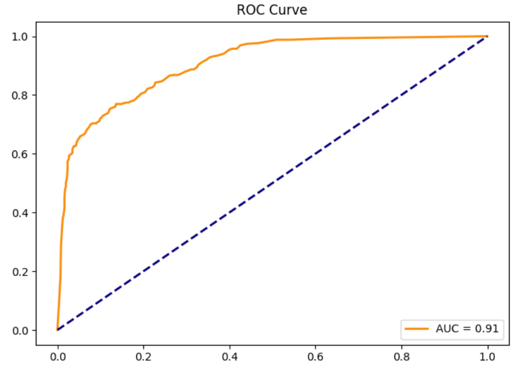

```markdown
# AI-Based Customer Churn Prediction System


---

## About the Project

This project is an end-to-end **Artificial Intelligence system** designed to predict and prevent Customer Churn in the telecommunications sector. 

Unlike traditional reactive analysis, this system acts proactively. It not only predicts **"who will leave"** but also utilizes **Explainable AI (XAI)** to understand **why they are leaving**. Furthermore, it includes a business-logic layer that automatically suggests specific **Retention Strategies** (e.g., discounts, VIP calls) to maximize customer lifetime value.

### Key Objectives
* **Prediction:** Classify customers as "Loyal" or "At-Risk" with high accuracy using Ensemble Learning.
* **Explainability:** Identify key drivers of churn (e.g., Short-term contracts, High monthly charges) using SHAP values.
* **Actionable Insights:** Generate an automated financial impact report and action plan to retain high-risk customers.

---
## Tech Stack

* **Language:** Python 3.9+
* **Data Manipulation:** Pandas, NumPy
* **Machine Learning:** Scikit-Learn (Random Forest, Gradient Boosting, Logistic Regression, Voting Classifier)
* **Imbalance Handling:** Imbalanced-Learn (SMOTE)
* **Explainability:** SHAP (SHapley Additive exPlanations)
* **Visualization:** Matplotlib, Seaborn

---

## Project Structure

```text
Customer_Churn_Prediction/
├── data/
│   └── proje_verisi.csv               # Raw dataset used for model training
├── demos/
│   └── Risk_Customer_Action_Plan.csv  # Action plan and high-risk customers generated by the model
├── images/                            # Visualization outputs and model metrics
│   ├── benchmark.png                  
│   ├── confusion_matrix.png          
│   ├── correlation_matrix.png        
│   ├── feature_importance.png         
│   ├── model_comparison.png          
│   ├── pr_curve.png                   
│   ├── roc_curve.png                  
│   └── shap_summary.png               
├── models/                            # Serialized files for deployment
│   ├── churn_prediction_model.pkl     # Trained final model (Voting Classifier)
│   └── scaler.pkl                     # Fitted StandardScaler object
├── notebooks/
│   └── CustomerChurnPrediction.ipynb  # Main Jupyter Notebook containing the full pipeline
├── requirements.txt                   # List of dependencies
└── README.md                          # Project documentation

```

---

## Performance Metrics

Our final deployed model is a **Voting Classifier** (combining Random Forest, Gradient Boosting, and Logistic Regression). Below are the key metrics derived from the test dataset:

| Metric | Score | Description |
| --- | --- | --- |
| **Accuracy** | **83.3%** | Overall correct prediction rate. |
| **AUC Score** | **0.84** | Robust capability to distinguish between Churn and Loyal customers. |
| **F1-Score** | **0.74** | Balanced metric for handling our imbalanced dataset. |

### Model Visualizations

| Confusion Matrix | ROC Curve |
| :---: | :---: |
|  |  |

---

## Business Impact (Financial Analysis)

We translated the model's predictions into concrete financial value. By identifying **454 high-risk customers** in the test set and applying a targeted retention strategy:

* **Potential Monthly Loss:** ~$31,888 (If no action is taken)
* **Retention Program Cost:** ~$4,540 (Discounts & marketing costs)
* **Estimated Net Monthly Savings:** **$11,404.29** 🚀

> *This projection assumes a 50% success rate in retaining the identified high-risk customers.*

---

## How to Run


1. **Install dependencies:**
```bash
pip install -r requirements.txt

```


2. **Run the Notebook:**
Launch Jupyter Notebook and open the main script.
```bash
jupyter notebook

```


Open `notebooks/CustomerChurnPrediction.ipynb` and run all cells. The trained model and reports will be generated automatically.

---

---

```

```
